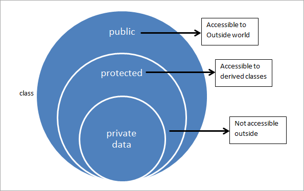

<h1>Low Level Design</h1>
 

  <b><i>
Encapsulation
</i></b>

	class Bird {
		string name, color, gender;
		public:
			Bird(string n, string c, string g) {
				name = n;
				color = c;
				gender = g;
			}

	};

	int main() {

		Bird b("gauraiya", "brown", "female");
		return 0;
	}

The above code has three problem:
<ol>
<li>Dirty code.</li>
<li>Client have to remember the sequence of parameter.</li>
<li>Backward compatibility.</li>
</ol>

Problems can be solved using Builder pattern.

